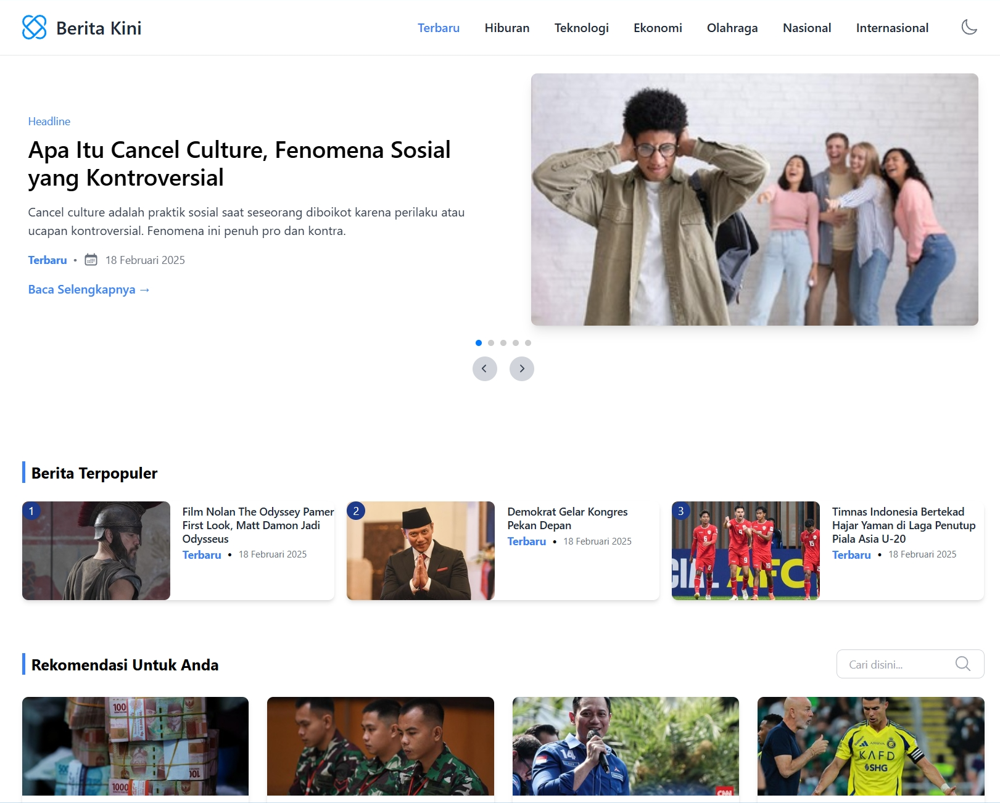
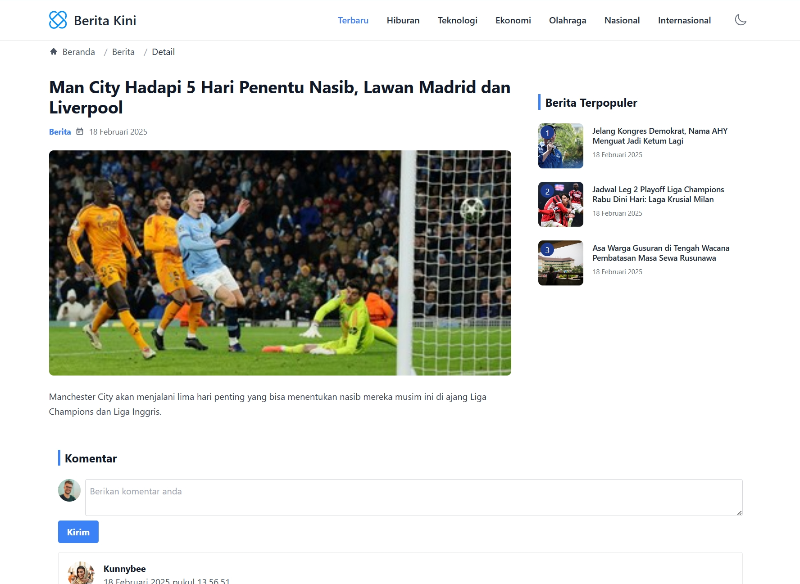

<p align="right">:sparkles:"Get to know the world now!":sparkles:</p>

<h1 align="center">Berita Kini </h1>
<p align="center">

</p>

## 🖼️ Preview





## 🎯 Project Goal
The goal of this project is to create a modern, user-friendly news portal website that delivers reliable, up-to-date news to users. The portal will cater to diverse audiences by offering curated content across various categories, ensuring easy access to important and trending information.

## 🚩 MVP

| Feature                                  | Status |
| ---------------------------------------- | ------ |
| Responsive Screen                        | ✅     |
| News Category                            | ✅     |
| Taillwind CSS                            | ✅     |
| Filter: Search by keyword                | ✅     |
| Pagination                               | ✅     |
| Comments                                 | ✅     |
| Themes: Light, Dark and OS Macthing Mode | ✅     |

## 💻 Technology That We Used

### Core Tech Stack:

- 
- 
- 
- 

### Styling:

- 
- 

### Utility Tech Stack:

- 
- 
- 

### Deployment:

- 

## 🌐 Demo Link

You can see the demo of this project here:

- [Berita Kini | Your Updatest News Portal!](https://berita-kini-iota.vercel.app/)

make sure to use the latest version of your browser.

## ⚙️ How to Install This Project

Before you begin, ensure you have the following installed:

- [Node.js](https://nodejs.org/) (version 16 or later recommended)
- [npm](https://www.npmjs.com/) or [yarn](https://yarnpkg.com/) package manager

### 1. Clone the Repository

Clone the project repository to your local machine using the following command:
```bash
git clone <https://github.com/pentahead/Berita-Kini-News-Portal>
```
### 2. Install Dependencies

Install the required packages using npm or yarn:
```bash
npm install
```
OR
```bash
yarn install
```

### 3. Start the Development Server

Run the development server to start the application:
```bash
npm run dev
```
OR
cc
```bash
yarn dev
```
This will launch the Vite development server. You can access the app at `http://localhost:5173` (or a different port if specified).
